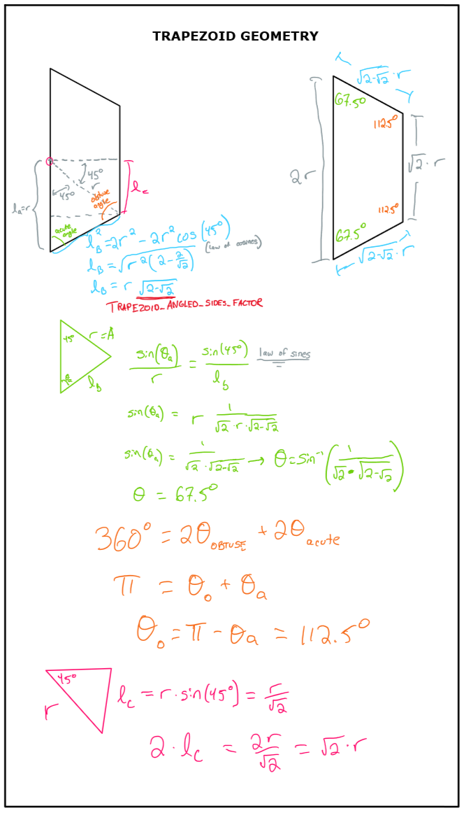
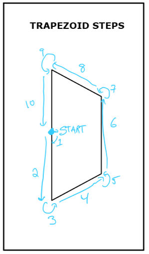
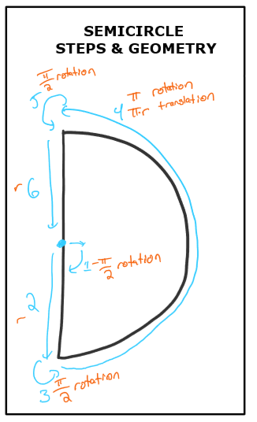

# Programming Assignment #1
Julien Blanchet &nbsp;&bull;&nbsp; COSC 181  &nbsp;&bull;&nbsp;Fall 2019  

Project Link: https://github.com/j55blanchet/dartmouth-cs181

## Description

My submission uses a different approach for task 1 & 2 as compared to task 3.

##### Tasks #1 and #2
Given that tasks 1 and 2 asked us to draw shapes with fixed geometry (scaled to a given `radius`), I decided to precompute the geometry and hardcode the sequence of movements. This is admittedly less flexible, but resulted in clean and very readable code. Drawing a trapezoid or a semicircle with the turtlebot simulator can be broken down into a sequences of rotations, translations, or arcs (both at the same time). From testing and reading the documentation online, I found that I could pass nearly any desired linear or angular velocity to the turtle and it'd complete the action within a second. Therefore, but publishing one `cmd_vel` per second in the predetermined sequence of rotations/translations, I could reliably direct the bot on these paths.

See the following figures to see the calculations for trapezoid & semicircle geometry.

##### Task #3

I used a different design for task #3. Since the input polyline was an unknown shape, I opted for a "main loop" design which uses the "rotation-then-translation" strategy for navigating to each point sequentially. Once per second (chosen because this is how long it takes `turtlesim_node` to execute a command), the program will:
1. Attempt to align itself towards the next target point (see bugs in Evaluation section).
1. If aligned, will move straight forward to next point.
1. If has reached target point (within a threshold), will internally set target as the next point along the polyline

To load the polyline into the program for task 3, I elected to use a JSON file, as it's a widely used standard that's human readable and easy to work with - and also because I was not successful in my initial attempt to pass in an array of points using rospy's parameter sever service. The filepath for the JSON file, however, is passed using rospy's parameter server.

Calculating the transformation matrices and performing the transformations to the local reference frame was straightforward. Using the `numpy.matrix` library (which is what rospy and many python programs used under the hood anyways), I was able to fairly easily embed the standard structure for homogenous 2D transformation matrices into the script. To verify that this worked correctly I constructed a simple polyline in the shape of a rectangle and checked the output against hand calculations. As a double check, I also coded the program to transform the points *back* into the world frame. The variable names for this section are a bit verbose, but I erred on the side of clarity here.

##### Program Structure

Here are some decisions I made on how to structure the project:
* I decided to separate each task into a different script. I find this to lead to clearer and more easily understood code.
* To enable quick iteration during development, I created `.launch` files for each of the tasks. This eliminated the need to manually relaunch `turtlesim_node` each time I wanted to test the script. It also makes it very easy to switch between different polyline files for task 3.

## Evaluation

All the task scripts work well and fully met the assignment objectives when I tested them. There are a few interesting behaviors in task #3 I observed which don't impact the correctness but are still room for improvements: 

* Sometimes it takes the turtle multiple tries to properly align itself towards a target point. I believe this to be due to the inaccuracy of the simulator, and the turtle almost always achieves the correct orientation within 3 tries in my testing.
* The turtle wastes a second upon realizing it's arrived at a target point and before starting the alignment process for the next one. I could fix this with some code refactoring, but since speed doesn't seem to be one of our objectives for this assignment, I left as is.

## Allocation of Effort
All coding, mathmatical calculations, and documentation on this project was done independently. I consulted various online programming resources while working on this assignment - citations are in the relevant comments. I also discussed high-level strategy and approaches for this assignment with peers from class and the robotics lab.

