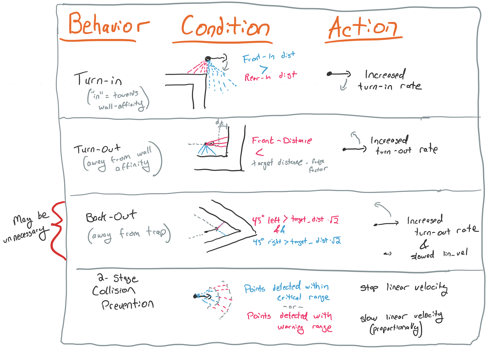

# Programming Assignment #2
Julien Blanchet &nbsp;&bull;&nbsp; COSC 181  &nbsp;&bull;&nbsp;Fall 2019  

Project Link: https://github.com/j55blanchet/dartmouth-cs181

## Overall Approach
I tried two different approaches to this assignment and each had strengths and weaknesses. My first implementation was a more traditional / pure PD-controller with the sole modification being the addition of a "collision prevention" behavior which stopped translational velocity when an object was detected in front of the robot. My second implementation added more significant custom behavior to enhance tracking in corners and to add a recovery behavior when the robot loses track of the wall it was following.

## Iteration 1: PD Controller + Collision Avoidance

#### Description
My first iteration was a straightforward implementation of the PD controller we designed for our homework assignment (to see the code at this stage, go to commit `c6bba16`). Upon startup, the controller examines the angle measurements on each side of it and choses the side with the nearest distance reading as its wall affinity (`self.wall_affinity`). Once the wall affinity  is chosen, the controller finds the distance to the closest point in a 90-degree sector facing the given side (the right side of the robot when following a wall on the left, and the opposite when following a wall on the right). It then calculates the `error` as the difference between that reading at the target distance (see the Evaluation section for implications of this design).

Similar to the problem in our recent homework, this controller outputs a constant linear velocity and controls the angular velocity based off the error. There is one notable exception: when the controller sees something (whether a wall or an obstacle) close by in front of the robot, the linear velocity is cut to zero. This solves two problems in one: the robot can account for obstacles moving in front of it, and the robot can better handle sharp turns in the wall ahead of it. 

#### Evaluation
The basic PD controller approach worked fairly well, especially given the simplicity of the decision-making logic. When the target distance, proportional constant, and derivitive constants were dialed in to account for the narrow hallways in our reference map, the robot was able to reliably follow the both the left and right walls - except for during sharp turns and junctions where the robot came close enough to an opposite wall. In these situations, the robot would sometimes detect a closest point on a different wall then it was following, causing start following the new wall on which this point was detected. This resulted in the robot skipping over some off-shooting corridors that it should have gone in to, and switching following the interior wall near the center of the building when it should have continued following the exterior wall.

The drawbacks mentioned above motivated me to examine the points of failure in my first design and augment the PD controller with additional behaviors designed to account for these shortcomings.

## Iteration 2: PD Controller + Specialized Behaviors

#### Description
My first iteration failed on sharp corners in both directions. To get the robot to enter offshoot corridors rather than skip over them, it was critical that the robot quickly take opportunities to turn into the empty space beside it when the wall it was following make a sharp turn. This "turn-in" behavior was the first of several specialized behaviors that I added to enhance the wall-tracking capabilities of my robot. Other improvements include (also, see table below):
* Using the average of several recent errors rather then only the most recent one when calculating the error derivitive. (more consistent conrol)
* A "warning zone" in addition to the collision prevention zone. This helped when approaching oncoming walls to give the robot enough time to turn before having to stop completely.
* Adding an override to the angular velocity when an obstacle or wall is detected in front. This improved responsiveness in these scenarios.

#### Evaluation

In the narrow corridors of the building map given to us for this assignement, these improvements allowed the robot to successfully track walls throughout the map. Thus, my primary objective was met.

As a downside, I found that the manual behaviors I implemented detracted form the robots wall-following when following straight walls. The behaviors exhibited themselves at undesired times and the robot failed to converge into a straight tangential path (see the Oppportunites for Improvement section) for my ideas on how this could be ameliorated.

#### Testing
To test the robots, I used the world file given as part of the assignment. I used both the both the blue robot (following wall on the right) and the initially commented out red robot (following wall on the left). I took special care to validate the robot's wall-tracking ability on sharp corners near the middle of the map. Lastly, I dragged the map to put the robot on the outside of the map, in order to evaluate the performance of the PD controller (and find an appropiate derivitive constant) in a steady-state scenario. Trial and error through this combination of tests led me to the constants you see, but I suspect a more systematic approach could led to better turned constants (even without a larger redesign, as suggested below).

#### Opportunities for Improvement
* A more advanced controller could control both the linear and angular velocity from the error. If the error was calculated as the deviation from a target path (including orientation) rather then simply the variation from a target wall-tracking distance
* Perhaps this target path could utilize an algorithm that attempts to infer the geometry of the wall from the laser scan point cloud and have the robot follow a tangential path thats offset a target distance.

## Allocation of Effort
All coding, mathmatical calculations, and documentation on this project was done independently. I consulted various online programming resources while working on this assignment - citations are in the relevant comments. I also discussed high-level strategy and approaches for this assignment with peers from class and the robotics lab.